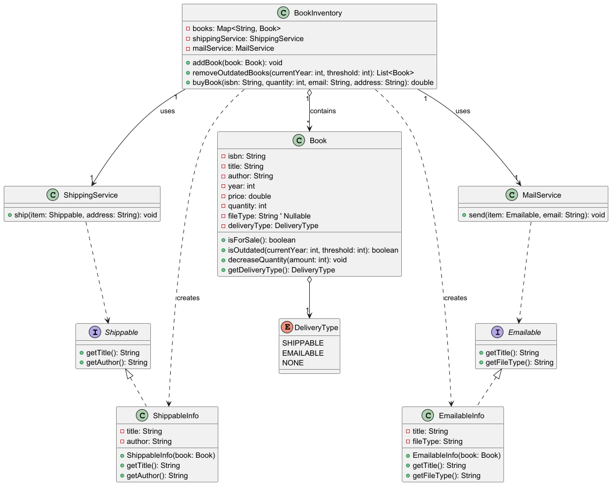

# Fawry Challenge
This challenge simulates a simple shopping cart system with shipping and checkout logic.

## Features
- Add/Remove product to cart
- Remove expired or out-of-stock products automatically before checkout
- Calculate total price and shipping fees
- Print detailed checkout receipt
- Handle exceptions if the cart is empty or the customer's balance is insufficient

## Class Diagram Overview
These are the key classes and interfaces:-
- `Product`: represents items in the store
- `Cart`: contains and manages the customer's chosen products 
- `Customer`: tracks customer balance
- `CheckoutService`: handle checkout exceptions and prints the receipt
- `ShippingService`: ships items and calculates shipping fees
- `Shippable`: interface that includes getName() and getWeight()
- `ShippableItem`: wrapper used for shipping



## Example Output
```
** Shipment Notice **
2x Cheese       701.0g

Total package weight is 701.0g

** Checkout Receipt
1x TV   30000.0
2x Cheese       30.0
----------------------
Subtotal        30060.0
Shipping        175.25
Amount          30235.25
```

## Run Instructions
```bash
cd src
javac -d bin src/main/java/com/malak/*.java
java -cp bin com.malak.Main
```
